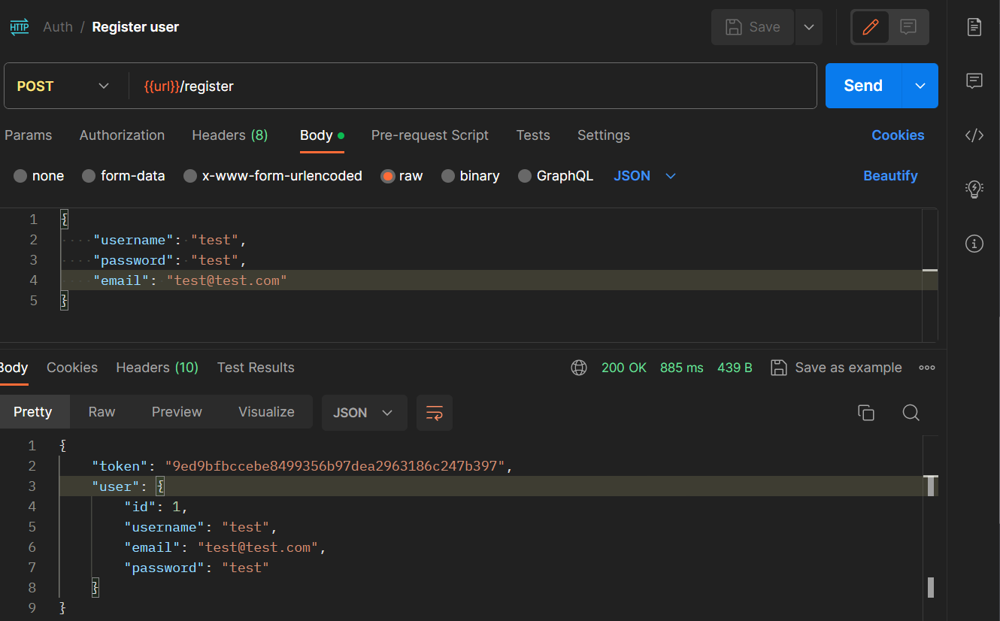
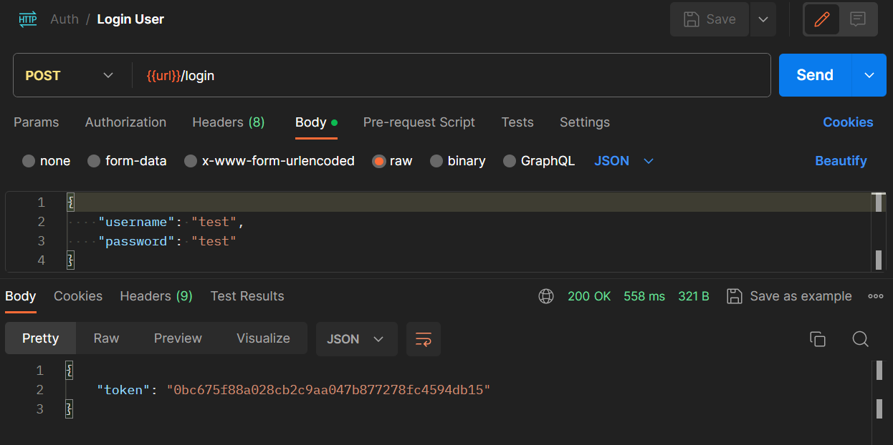
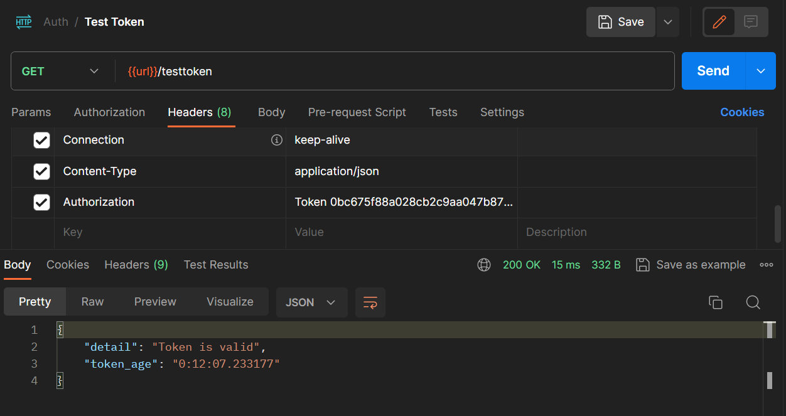

# **DjangoHRManagementAPI**

The "Django HR Management API" project aims to develop an advanced REST API using the Django Python framework for human resources management in a company. This API will allow users to effectively manage employee information, including personal details, work histories, attendance records, and salary records. The API will offer strong authentication and authorization, custom reporting, email notifications, and comprehensive documentation for ease of use. API security will be ensured through practices such as token authentication and protection against common attacks. Additionally, the project will be designed to be scalable and easy to maintain, allowing the company's future growth to be managed efficiently.

  

## **Authentication and Authorization**

The Auth application within the project has the registration and login functionalities of the users of the *Django HR Management API*, users can only access the resources of the rest api if they are authorized

### **Registration**
The register method processes user registration requests, creating a new user account if the provided data is valid. The method returns a JSON response with the user's data and a token for authentication.

### **Login**

The login method processes user login requests, authenticating the user if the provided data is valid. The method returns a JSON response a token for authorization.

### **Check token**

The check token method processes user token requests, return a JSON response with the token valid time if the provided token is valid.

## **Documentation**
To improve user experience and streamline implementation, the API incorporates the Swagger documentation system. Swagger facilitates a comprehensive, easy-to-use documentation process, ensuring users have clear guidance on API endpoints, data formats, authentication methods, and available functionality.

